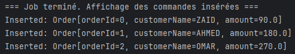
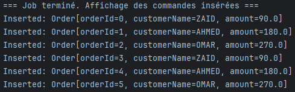
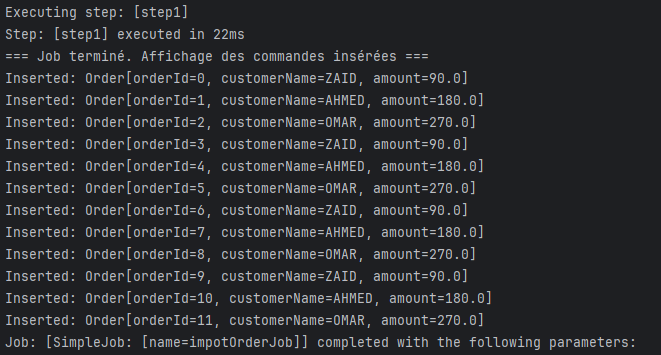

### **README - Spring Boot Batch Processing with HSQLDB**

### **1. Description du projet**

Ce projet est une démonstration simple de **Spring Batch** avec **Spring Boot** utilisant **HSQLDB** comme base de données en mémoire.  
L'application effectue les étapes suivantes :

>1. **Lecture** : Les données sont lues à partir d'un fichier CSV `orders.csv`.
>2. **Traitement** : Une remise de **10%** est appliquée au montant des commandes.
>3. **Écriture** : Les commandes traitées sont insérées dans la table `orders` de la base HSQLDB.
>4. **Planification** : Le job Batch est planifié pour s'exécuter à intervalles réguliers avec `@Scheduled`.

---
#### **Technologies utilisées**

- **Spring Boot** : Framework pour l'application.
- **Spring Batch** : Traitement par lots.
- **HSQLDB** : Base de données en mémoire pour l'exécution rapide.
- **Java 21** : Version du JDK utilisée.
- **Maven** : Outil de build.
---

### **2. Structure du projet**
```
main/
│
├── java/
│   └── ma.enset.simple_demo_springbatch/
│       ├── orderConfiguration/
│       │   ├── BatchConfiguration
│       │   │     + Reader (lecture CSV), Processor (traitement), 
│       │   │     + Writer (insertion en base), Step et Job.
│       │   │
│       │   ├── JobCompletionNotificationListener
│       │   │   - Listener qui s'exécute après le job pour afficher les commandes insérées.
│       │   │
│       │   ├── Order
│       │   │   - Représentation de l'objet `Order`
│       │   │
│       │   ├── OrderItemProcessor
│       │   │   - Applique une remise de 10% sur le montant des commandes.
│       │   │
│       │   └── OrderJobScheduler
│       │       - Planifie l'exécution du job avec `@Scheduled`.
│       │
│       └── productConfiguration/
│       └── SimpleDemoSpringBatchApplication
│
├── resources/
│   ├── application.properties
│   ├── orders.csv
│   └── schema.sql
```
---

### **3. Planification des jobs**

**La classe `OrderJobScheduler` utilise `@Scheduled` pour automatiser l'exécution du job.**

- **Exécution à un intervalle fixe :**
   ```java
   @Scheduled(fixedRate = 6000) // Toutes les 6 secondes
   ```
    - **Explication** : Le job démarre **6 secondes après le début de la tâche précédente**.

- **Planification avec `cron` :**
   ```java
   @Scheduled(cron = "0 0 0 * * *") // Minuit chaque jour
   ```
    - **Explication** : Planifie l'exécution à **00:00:00 chaque jour**.

| Paramètre `cron`         | Description                         |
|---------------------------|-------------------------------------|
| `0`                      | Secondes : 0                       |
| `0`                      | Minutes : 0                        |
| `0`                      | Heures : 0                         |
| `*`                      | Tous les jours du mois             |
| `*`                      | Tous les mois                      |
| `*`                      | Tous les jours de la semaine       |

---

### **4. Exécution et résultats**

1. **Exécution du job :**
    - L'application lit le fichier `orders.csv`, traite les données en appliquant une remise de 10%, et insère les résultats dans la table `orders`.

2. **Logs des résultats :**
    - Le Listener `JobCompletionNotificationListener` affiche les commandes insérées après chaque job.

3. **Screenshots des résultats**  
    - **Exécution initiale :**  
      __
    - **Insertion dans la base :**  
      __
   
      __

---